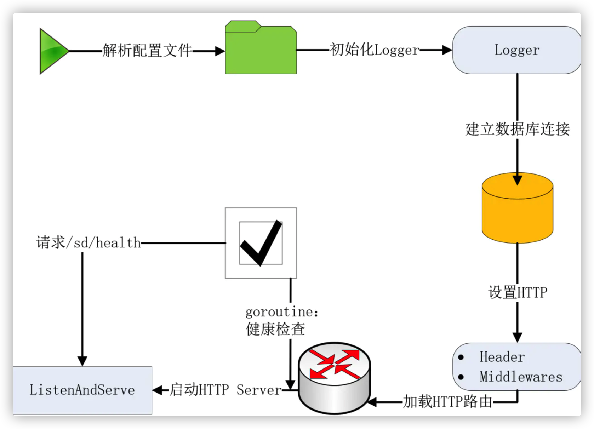
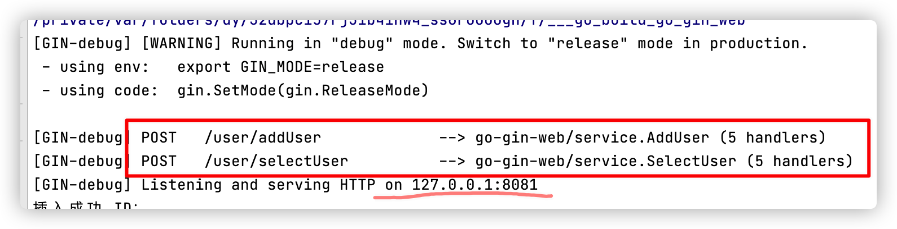
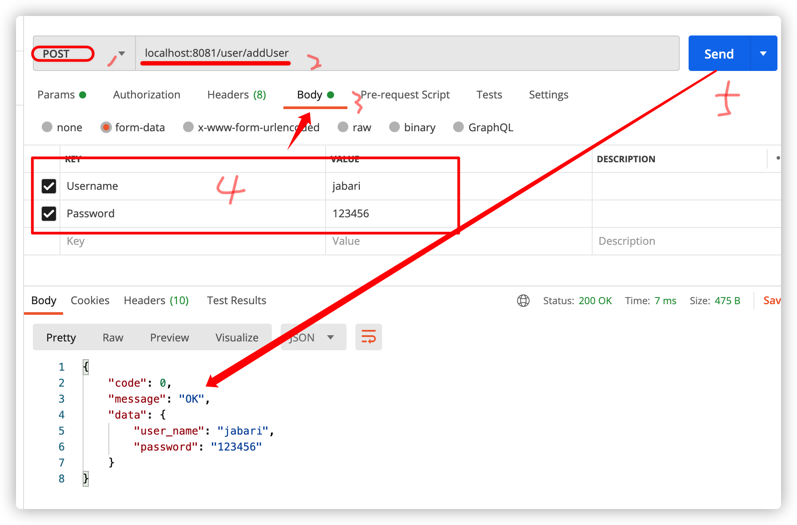
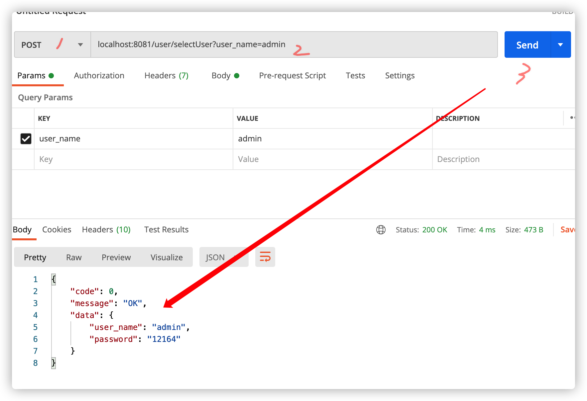
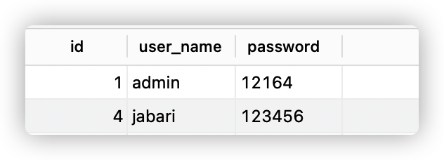

├── 22220-12-12.log.          >日志
├── README.md
├── conf                               >配置
│   └── config.yaml
├── config                            >处理配置
│   └── config.go
├── go.mod
├── go.sum
├── handler                           >用来读取输入，并将处理流程转发给实际的处理函数，最后返回结果
│   └── handler.go
├── main.go                          >Go程序唯一入口
├── model                             >实体模型
│   ├── init.go
│   ├── model.go                 >存放一些公用的go struct
│   └── user.go
├── pkg                                  >引用的包
│   ├── constrvar
│   └── errno
│       ├── code.go
│       └── errno.go
├── router                            >路由相关处理
│   ├── middleware           >中间件
│   │   └── middleware.go
│   └── router.go              >路由
├── service                          >业务处理
│   └── user.go
└── util

运行

测试：

添加用户

查询用户

数据库

